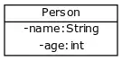

### Class inheritance 
Learning Objectives
- You know that in the Java programming language every class inherits the Object class, and you understand why every object has methods toString, equals, and hashCode.- 
- You are familiar with the concepts of inheritance, superclass, and subclass.- 
- You can create classes that inherit some of their properties from another class.- 
- You can call a constructor or method that is defined in a superclass.- 
- You know how an object's executed method is determined, and you are familiar with the concept of polymorphism.- 
- You can assess when to use inheritance, and you can come up with an example that is ill-suited for inheritance

Classes are used to clarify the concepts of the problem domain in object-oriented programming. Every class we create adds functionality to the programming language. This functionality is needed to solve the problems that we encounter. An essential idea behind object-oriented programming is that solutions rise from the interactions between objects which are created from classes.An object in object-oriented programming is an independent unit that has a state, which can be modified by using the methods that the object provides. Objects are used in cooperation; each has its own area of responsibility. For instance, our user interface classes have so far made use of Scanner objects.
Every Java class extends the class Object, which means that every class we create has at its disposal all the methods defined in the Object class. If we want to change how these methods are defined in Object function, they must be overridden by defining a new implementation for them in the newly created class. The objects we create receive the methods equals and hashCode, among others, from the Object class.
Every class derives from Object, but it's also possible to derive from other classes. When we examine the API (Application Programming Interface) of Java's ArrayList, we notice that ArrayList has the superclass AbstractList. AbstractList, in turn, has the class Object as its superclass.

  java.lang.Object
  java.util.AbstractCollection<E>
    java.util.AbstractList<E>
       java.util.ArrayList<E>
Each class can directly extend only one class. However, a class indirectly inherits all the properties of the classes it extends. So the ArrayList class derives from the class AbstractList, and indirectly derives from the classes AbstractCollection and Object. So ArrayList has at its disposal all the variables and methods of the classes AbstractList, AbstractCollection, and Object. I.e ArrayList extends from AbstractList which extends from AbstractCollection which extends from Object. 
We use the extends keyword to inherit the properties of a class. With this the new class has access to all the properties of the class it extends. The new class that inherits is called subclass while the class which properties are inherited is called superclass.
The class definition public class Engine extends Part indicates that the class Engine inherits the functionality of the class Part. We also define an object variable engineType in the class Engine.
The constructor of the Engine class is worth some consideration. On its first line we use the keyword super to call the constructor of the superclass. The call super(identifier, manufacturer, description) calls the constructor public Part(String identifier, String manufacturer, String description) which is defined in the class Part. Through this process the object variables defined in the superclass are initiated with their initial values. After calling the superclass constructor, we also set the proper value for the object variable engineType.
The super call bears some resemblance to the this call in a constructor; this is used to call a constructor of this class, while super is used to call a constructor of the superclass. If a constructor uses the constructor of the superclass by calling super in it, the super call must be on the first line of the constructor. This is similar to the case with calling this (must also be the first line of the constructor).

## Access modifiers private, protected, and public

If a method or variable has the access modifier private, it is visible only to the internal methods of that class. Subclasses will not see it, and a subclass has no direct means to access it. So, from the Engine class there is no way to directly access the variables identifier, manufacturer, and description, which are defined in the superclass Part. The programmer cannot access the variables of the superclass that have been defined with the access modifier private.

A subclass sees everything that is defined with the public or protected access modifier in the superclass. If we want to define some variables or methods that are visible to the subclasses but Invisible to everything else, we can use the access modifier protected to achieve this.

# Calling the constructor of the superclass
You use the keyword super to call the constructor of the superclass. The call receives as parameters the types of values ​​that the superclass constructor requires. If there are multiple constructors in the superclass, the parameters of the super call dictate which of them is used just like it is if we were instantiating an object of the superclass. The super call must be on the first line of the constructor.
When the constructor (of the subclass) is called, the variables defined in the superclass are initialized. The events that occur during the constructor call are practically identical to what happens with a normal constructor call. If the superclass doesn't provide a non-parameterized constructor, there must always be an explicit call to the constructor of the superclass in the constructors of the subclass.
# Calling a superclass method
You can call the methods defined in the superclass by prefixing the call with super, just as you can call the methods defined in this class by prefixing the call with this. For example, when overriding the toStringmethod, you can call the superclass's definition of that method in the following manner:

@Override
public String toString() {
    return super.toString() + "\n  And let's add my own message to it!";}

### Polymorphism
Regardless of the type of the variable, the method that is executed is always chosen based on the actual type of the object. Objects are polymorphic, which means that they can be used via many different variable types. The executed method always relates to the actual type of the object. This phenomenon is called polymorphism.
# The actual type of an object dictates which method is executed
An object's type decides what the methods provided by the object are. For instance, we implemented the class Student earlier. If a reference to a Student type object is stored in a Person type variable, only the methods defined in the Person class (and its superclass and interfaces) are available
So an object has at its disposal the methods that relate to its type, and also to its superclasses and interfaces. The Student object above offers the methods defined in the classes Person and Object. So if an object(a subclass) method is accessed, the methods in the subclass i.e the current object is first used and in it absence the superclass methods is used i.e even the subclass methods will override the methods of superclass if both subclass and super has the methods defined in each. Even if we type cast either upcast or downcast between a subclass to it super class, the methods of the subclass will always override those in the superclass.
The method to be executed is chosen based on the actual type of the object, which means the class whose constructor is called when the object is created. If the method has no definition in that class, the version of the method is chosen from the class that is closest to the actual type in the inheritance hierarchy. The actual class of the object is permanent even if we used it as a variable to another object or casting it. This make the object to always try in retaining it methods if possible.
In the last exercise we wrote a new toString implementation for Student to override the method that it inherits from Person. The class Person had already overridden the toString method it inherited from the class Object
 Manhattan distance means the distance between two points if you can only travel in the direction of the coordinate axes. It is used in many navigation algorithms, for example.
 As we can see, the sequence of events caused by the method call has multiple steps. The principle, however, is clear: The definition for the method is first searched for in the class definition of the actual type of the object. If it is not found, we next examine the superclass. If the definition cannot be found there, either, we move on to the superclass of this superclass, etc...

 ## When is inheritance worth using?
 Inheritance is a tool for building and specializing hierarchies of concepts; a subclass is always a special case of the superclass. If the class to be created is a special case of an existing class, this new class could be created by extending the existing class. For example, in the previously discussed car part scenario an engine is a part, but an engine has extra functionality that not all parts have.
 When inheriting, the subclass receives the functionality of the superclass. If the subclass doesn't need or use some of the inherited functionality, inheritance is not justifiable. Classes that inherit will inherit all the methods and interfaces from the superclass, so the subclass can be used in place of the superclass wherever the superclass is used. It's a good idea to keep the inheritance hierarchy shallow, since maintaining and further developing the hierarchy becomes more difficult as it grows larger. Generally speaking, if your inheritance hierarchy is more than 2 or 3 levels deep, the structure of the program could probably be improved.
 Inheritance is not useful in every scenario. For instance, extending the class Car with the class Part (or Engine) would be incorrect. A car includes an engine and parts, but an engine or a part is not a car. More generally, if an object owns or is composed of other objects, inheritance should not be used.

 _When using inheritance, you should take care to ensure that the Single Responsibility Principle holds true. There should only be one reason for each class to change. If you notice that inheriting adds more responsibilities to a class, you should form multiple classes of the class._

## Abstract classes
Sometimes, when planning a hierarchy of inheritance, there are cases when there exists a clear concept, but that concept is not a good candidate for an object in itself. The concept would be beneficial from the point of view of inheritance, since it includes variables and functionality that are shared by all the classes that would inherit it. On the other hand, you should not be able to create instances of the concept itself.
An abstract class combines interfaces and inheritance. You cannot create instances of them — you can only create instances of subclasses of an abstract class. They can include normal methods which have a method body, but it's also possible to define abstract methods that only contain the method definition. Implementing the abstract methods is the responsibility of subclasses. Generally, abstract classes are used in situations where the concept that the class represents is not a clear independent concept. In such a case you shouldn't be able to create instances of it.
To define an abstract class or an abstract method the keyword abstract is used. An abstract class is defined with the phrase public abstract class *NameOfClass*; an abstract method is defined by public abstract returnType nameOfMethod
The greatest difference between interfaces and abstract classes is that abstract classes can contain object variables and constructors in addition to methods. Since you can also define functionality in abstract classes, you can use them to define e.g. default behavior. In the user interface above storing the name of the operation used the functionality defined in the abstract Operation class.
An abstract class is a class that can not be initiated by itself, it needs to be subclassed by another class to use its properties.
An abstract class can be created using "abstract" keywords.
We can have an abstract class without any abstract method.
If the Child class is unable to provide implementation to all abstract methods of the Parent class then we should declare that Child class as abstract so that the next level Child class should provide implementation to the remaining abstract method.
if a/an (abstract or non) class as an abstract methods so every class that inherits it, must implement it or they must be declared abstract and the class itself i.e the superclass must be declared abstract. The abstract methods can only be defined by an abstract class. And Abstract methods do not specify a body
if a class inherits abstract methods, it must either implement them or remain abstract. Java enforces this rule strictly to ensure that all method contracts are fulfilled before an object can be created.

### Interfaces

An Interface in Java programming language is defined as an abstract type used to specify the behavior of a class. An interface in Java is a blueprint of a behavior. A Java interface contains static constants and abstract methods.
Note: In Java, the abstract keyword applies only to classes and methods, indicating that they cannot be instantiated directly and must be implemented. When we decide on a type of entity by its behavior and not via attribute we should define it as an interface.
To declare an interface, use the interface keyword. It is used to provide total abstraction. That means all the methods in an interface are declared with an empty body and are public and all fields are public, static and final by default. A class that implements an interface must implement all the methods declared in the interface. To implement the interface, use the implements keyword.

# When to Use Class and Interface?
Use a Class when:

Use a class when you need to represent a real-world entity with attributes (fields) and behaviors (methods).
Use a class when you need to create objects that hold state and perform actions
Classes are used for defining templates for objects with specific functionality and properties.
Use a Interface when:

Use an interface when you need to define a contract for behavior that multiple classes can implement.
Interface is ideal for achieving abstraction and multiple inheritance.

# Multiple Inheritance in Java Using Interface
Java does not support multiple inheritance with classes to avoid ambiguity, but it supports multiple inheritance using interfaces.

# New Features Added in Interfaces in JDK 8
There are certain features added to Interfaces in JDK 8 update mentioned below:

1. Default Methods
Interfaces can define methods with default implementations.
Useful for adding new methods to interfaces without breaking existing implementations.

# 2. Static Methods
Interfaces can now include static methods.
These methods are called directly using the interface name and are not inherited by implementing classes.
Another feature that was added in JDK 8 is that we can now define static methods in interfaces that can be called independently without an object. These methods are not inherited.

We can use interfaces to define behavior that's required from a class, i.e., its methods. They're defined the same way that regular Java classes are, but "public interface ..." is used instead of "public class ... " at the beginning of the class. Interfaces define behavior through method names and their return values. However, they don't always include the actual implementations of the methods. A visibility attribute on interfaces is not marked explicitly as they're always public.
The classes that implement the interface decide how the methods defined in the interface are implemented. A class implements the interface by adding the keyword implements after the class name followed by the name of the interface being implemented.
Implementations of methods defined in the interface must always have public as their visibility attribute.

# An Interface Is a Contract of Behavior
When a class implements an interface, it signs an agreement. The agreement dictates that the class will implement the methods defined by the interface. If those methods are not implemented in the class, the program will not function.
The interface defines only the names, parameters, and return values ​​of the required methods. The interface, however, does not have a say on the internal implementation of its methods. It is the responsibility of the programmer to define the internal functionality for the methods.
Objects can be instantiated from interface-implementing classes just like with normal classes. They're also used in the same way, for instance, as an ArrayList's type.
## Interface as Variable Type
The type of a variable is always stated as its introduced. There are two kinds of type, the primitive-type variables (int, double, ...) and reference-type variables (all objects).An object's type can be other than its class. For example, the type of the Ebook class that implements the Readable interface is both Ebook and Readable. Similarly, the text message also has multiple types. Because the TextMessage class implements the Readable interface, it has a Readable type in addition to the TextMessage type. If an object implement an interface, apart from it own class, it still another class for the interface it is implementing from i.e also has behavior of the interface.
Because an interface can be used as a type, it's possible to create a list that contains objects of the interface's type. Note; interface cannot be instantiated so in the case of what we are saying here, objects that is also a class of the interface are the values we are going to passed where the interface is expected.
_Note that although the Ebook class that inherits the Readable interface class is always of the interface's type, not all classes that implement the Readable interface are of type Ebook. You can assign an object created from the Ebook class to a Readable-type variable, but it does not work the other way without a separate type conversion._

_Readable readable = new TextMessage("ope", "TextMessage is Readable!"); // works_
_TextMessage message = readable; // doesn't work_

_TextMessage castMessage = (TextMessage) readable; // works if, and only if, readable is of text message t_

Type conversion succeeds if, and only if, the variable is of the type that it's being converted to. Type conversion is not considered good practice, and one of the few situation where it's use is appropriate is in the implementation of the equals method.
Because an interface can be used as a type, it's possible to create a list that contains objects of the interface's type.

# Interfaces as Method Parameters
The true benefits of interfaces are reaped when they are used as the type of parameter provided to a method. Since an interface can be used as a variable's type, it can also be used as a parameter type in method calls. The value of the parameter method of the class lies in the fact that it can be given any class that implements the interface as a parameter. Were we to call the method with any object instantiated from a class that inherits the interface, the method would function as desired.

# Interface as a return type of a method
Interfaces can be used as return types in methods — just like regular variable types. In the next example is a class Factory that can be asked to construct different objects that implement the Packable interface.

 Note that there is no need to write an empty constructor without
  parameters if the class doesn't have other constructors.
  In these cases Java automatically creates a default constructor for
  the class which is an empty constructor without parameters.

# Reducing the dependencies between classes
Using interfaces in programming enables reducing dependencies between classes. In the previous example the Packer does not depend on the classes that implement the Packable interface. Instead, it just depends on the interface. This makes possible to add new classes that implement the interface without changing the Packer class. What is more, adding new Packable classes doesn't affect the classes that use the Packer class.

# Built-in Interfaces
Java offers a considerable amount of built-in interfaces. Here we'll get familiar with four commonly used interfaces: List, Map, Set, and Collection.

- # The List Interface
The List interface defines the basic functionality related to lists. Because the ArrayList class implements the List interface, one can also use it through the List interface.
From the perspective of the user, both implementations of the List interface work the same way. The interface abstracts their inner functionality. The internal structures of ArrayList and LinkedList differ quite a bit.
ArrayList saves objects to an array where fetching an object with a specific index is very fast. On the other hand LinkedList constructs a list where each element contains a reference to the next element in the list. When one searches for an object by index in a linked list, one has to go though the list from the beginning until the index.
One can see noticeable performance differences between list implementations if the lists are big enough. The strength of a linked list is that adding to it is always fast. ArrayList, on the other hand, is backed by an array, which needs to be resized each time it gets full. Resizing the array requires creating a new array and copying the values from the old array to the new one. On the other hand, searching objects by index is much faster in an array list compared to a linked list.
_For the problems that you encounter during this course you should almost always choose ArrayList. However, "interface programming" is beneficial: implement your programs so that you'll use the data structures through the interfaces._

# The Map Interface
The Map interface in Java is a powerful part of the Collections Framework that allows you to store key-value pairs — like a dictionary or lookup table. It’s ideal when you want to associate one object (the key) with another (the value), and retrieve values efficiently based on their keys. The Map interface s what defines the basic behavior associated with hash tables. Because the HashMap class implements the Map interface, it can also be accessed through the Map interface.

🗺️ Overview of the Map Interface
Map<KeyType, ValueType> map = new HashMap<>();

- Key: Must be unique. Duplicate keys overwrite the previous value.
- Value: Can be duplicated.
 Common Implementations:
- HashMap – Fast, unsorted, allows null keys/values.
- TreeMap – Sorted by keys (natural order or custom comparator).
- LinkedHashMap – Maintains insertion order.
- Hashtable – Legacy, synchronized, no null keys/values.
- ConcurrentHashMap – Thread-safe for concurrent access.

🧪 Example
Map<String, Integer> scores = new HashMap<>();
scores.put("Alice", 90);
scores.put("Bob", 85);
scores.put("Charlie", 92);

System.out.println(scores.get("Bob")); // Output: 85

🧠 Why Use Map?
- Fast lookups: Ideal for caching, indexing, and associative data.
- Flexible: Can store any object types as keys and values.
- Powerful iteration: Use entrySet() to loop through key-value pairs.

The keys to the hash table are obtained using the keySet method.
he keySet() method of a Map returns a Set containing all the keys in the map.
You can use a for-each loop to iterate through this set.
The values() method returns a Collection containing all the values in the map.
This collection may include duplicate values, and it can also be looped through using a for-each loop.
The returned key set implements the Set interface, and the values collection implements the Collection interface.

# The Set Interface
The Set interface in Java is part of the Collections Framework, and it represents a collection of unique elements — meaning it does not allow duplicates. If you try to add the same element twice, the second attempt will be ignored.
🧩 Key Characteristics of Set
- No duplicates: Each element must be unique.
- Unordered (in most implementations): The order of elements is not guaranteed.
- Implements Collection: So it inherits methods like add(), remove(), size(), etc.
🧠 When to Use Set
- You want to avoid duplicates (e.g., storing unique usernames).
- You need fast lookups without caring about order (HashSet).
- You want to preserve insertion order (LinkedHashSet).
- You need sorted elements (TreeSet).
